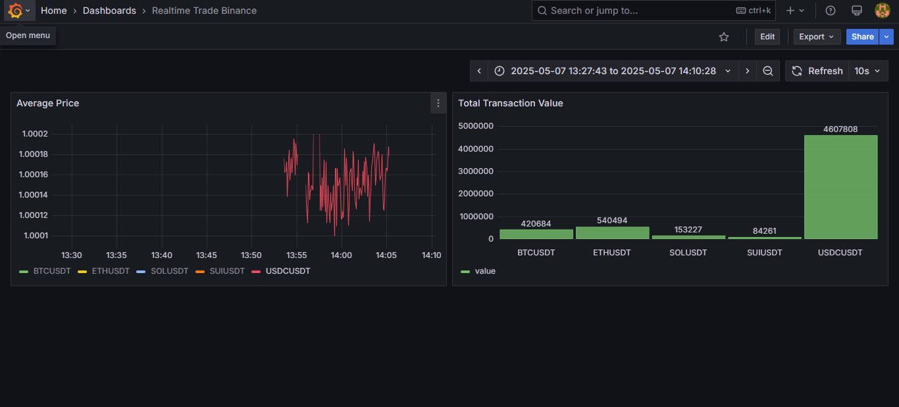
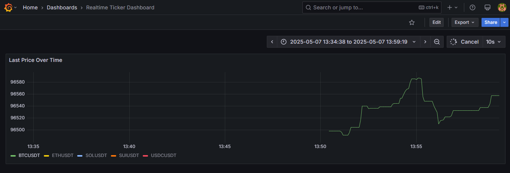
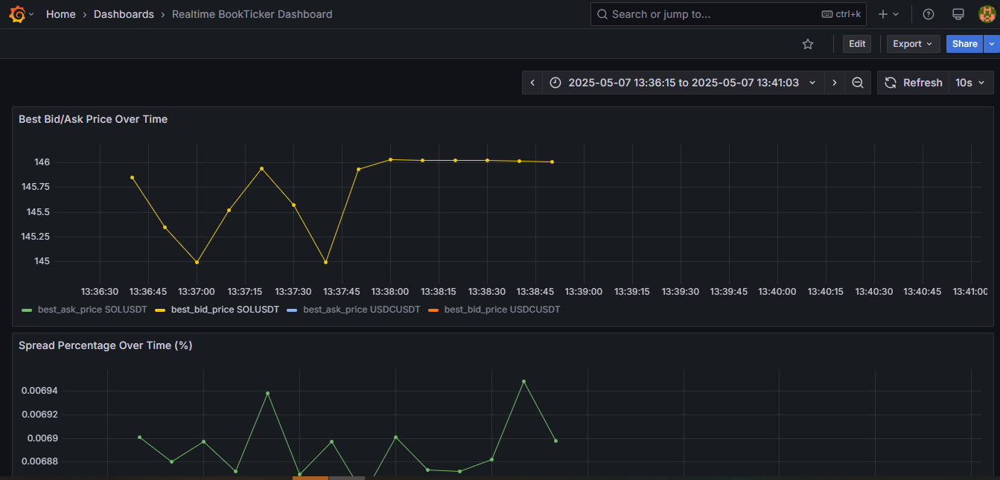
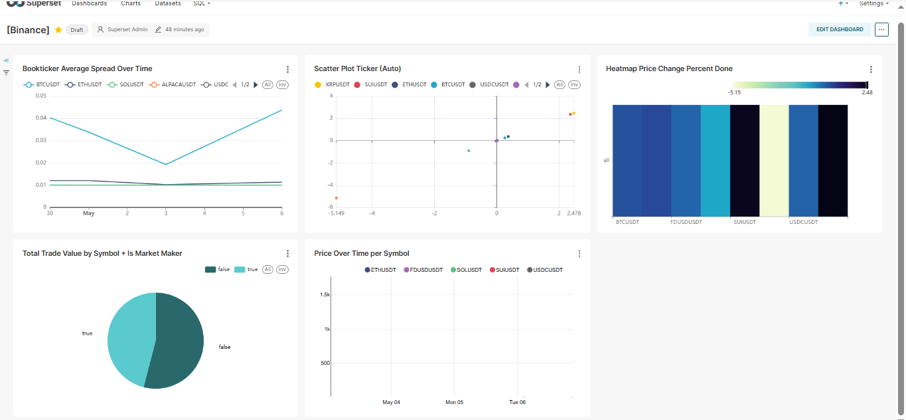

# DWH-Stock-BigData: Real-time Stock Data Warehouse System

A project to build a Data Warehouse (DWH) system to collect, store, and visualize real-time stock trading data (specifically cryptocurrencies from Binance).

## Table of Contents

- [Introduction](#introduction)
- [Features](#features)
- [System Architecture](#system-architecture)
- [Technologies Used](#technologies-used)
- [Installation](#installation)
  - [Prerequisites](#prerequisites)
  - [Setup Steps](#setup-steps)
- [Running the Application](#running-the-application)
  - [Accessing Services](#accessing-services)
  - [Visualizations](#visualizations)
- [Data Streams Processed](#data-streams-processed)
- [Troubleshooting](#troubleshooting)
- [Key Takeaways & Experiences](#key-takeaways--experiences)
- [Contact](#contact)

## Introduction

DWH-Stock-BigData is engineered to construct a robust, real-time data warehouse system tailored for cryptocurrency trading data sourced from Binance. This project implements an end-to-end data pipeline, capturing live market movements and transforming them into actionable insights for both immediate monitoring and long-term analysis.

The core data flow encompasses:
-   **Live Data Ingestion:** Fetching real-time data streams (such as `trade`, `ticker`, and `bookTicker`) for popular cryptocurrency pairs directly from Binance's WebSocket API.
-   **High-Throughput Streaming:** Leveraging Apache Kafka as a resilient message broker to process and distribute these data streams efficiently.
-   **Real-time Monitoring & Visualization:** Storing time-sensitive data in InfluxDB, enabling immediate visualization and alerting through dynamic Grafana dashboards.
-   **Long-Term Archival & Business Intelligence:** Archiving historical data to AWS S3 for cost-effective, scalable storage. This data can then be queried using AWS Athena and visualized with Apache Superset for in-depth analysis and business intelligence reporting.


## Features

- Real-time data collection from Binance WebSocket API.
- Configurable list of top cryptocurrency pairs (TOP COINs) to track (or specify how it's automatic).
- Utilizes Apache Kafka as a message broker for handling large data streams.
- Supports three main data streams from Binance (`trade`, `ticker`, `bookTicker`), configurable via the `.env` file.
- Automatic creation of Kafka topics based on TOP COINs and stream types.
- Dual data storage strategy:
    - InfluxDB for efficient real-time time-series data storage and querying.
    - AWS S3 for scalable and cost-effective long-term data archival.
- Real-time data visualization and monitoring with automatically configured Grafana dashboards.
- Historical data analysis and business intelligence capabilities using:
    - AWS Athena for querying data directly from S3 using standard SQL.
    - Apache Superset for creating interactive dashboards and visualizations based on Athena queries.
- **Independent Prediction Module:** Features a standalone module using the Informer model for time-series forecasting. Supports on-demand training and prediction, allowing for flexible and up-to-date trend analysis.
- Modular architecture allows for easy addition of new stream types.


## System Architecture
Below is a high-level overview of the system architecture:

## Technologies Used

**Core & Orchestration:**
- **Python**: Primary language for data producers, consumers, and automation.
- **Docker & Docker Compose**: For containerization and environment management.

**Data Ingestion & Streaming:**
- **Binance WebSocket API**: Real-time cryptocurrency data source.
- **Apache Kafka**: Distributed message broker for high-throughput data streams.

**Real-time Path (Storage & Visualization):**
- **InfluxDB**: Time-series database for real-time data.
- **Grafana**: Dashboards for real-time monitoring and visualization.

**Batch/Archival Path (Storage, Querying & BI):**
- **AWS S3**: Scalable object storage for long-term data archival.
- **AWS Athena**: Interactive SQL-based querying service for data in S3.
- **Apache Superset**: BI platform for creating dashboards from Athena data.

**Prediction Module (ML-based):**
- **Informer**: A self-contained forecasting component that uses Informer architecture to predict crypto trends, supporting retraining and re-prediction on demand.


## Installation

### Prerequisites

Before you begin, ensure you have the following installed:
- Git
- Docker (latest version recommended)
- Docker Compose (latest version recommended)
- An AWS account (for S3, Athena)
- AWS CLI configured (optional, but helpful for manual AWS resource checks/setup)
- Interneted connection


### Setup Steps

1.  **Clone the repository and download zip files:**
    ```bash
    git clone https://github.com/THANHTINHSHR/DWH-Stock-BigData.git
    cd DWH-Stock-BigData
    ```

    Download the required "jar" and "tar" folders from this [Google Drive link.](https://drive.google.com/drive/folders/1eZhnL0KiCo_QIFfYhHR31ZDMYf5BDM2a?usp=sharing)  
    After downloading, copy both folders into your project directory.

2.  **Configure environment variables:**
    Create a `.env` file in the project root (you can copy `.env.example` if provided in the repository) and populate it with your specific configuration values.
    Pay close attention to API keys, tokens, and AWS credentials. Some keys (like for InfluxDB and Grafana) will be obtained in the next step.
    For `SUPERSET_SECRET_KEY`, generate a strong random string (e.g., using `openssl rand -base64 32`) and add it to your `.env` file now.
    


3.  **Initial Service Startup & Key Generation:**

    -   Run:
        ```bash
        docker-compose -f docker-compose-services.yml up --build
        ```
    - Access the InfluxDB UI (e.g., `http://localhost:8086`) and Grafana UI (e.g., `http://localhost:3000`) to complete their initial setup and generate the necessary API tokens/keys (`INFLUXDB_TOKEN`, `GRAFANA_KEY`).


4.  **Configure Keys & Finalize Setup:**
    -   Update your `.env` file with the `INFLUXDB_TOKEN` and `GRAFANA_KEY` obtained in the previous step.
    -   Ensure the `SUPERSET_SECRET_KEY` (generated in step 2) is also correctly set in your `.env` file.
    -   After config, build two container:

        - dwh_stock_bigdata
        ```bash
        docker-compose -f docker-compose-project.yml build
        ```
    - For Informer module:
        - informerAI_trainer
        ```bash
        docker-compose -f docker-compose-trainer.yml build
        ```
        - informerAI_trainer
        ```bash
        docker-compose -f docker-compose-predictor.yml build
        ```
        All components should now be fully functional with the correct API keys. After this step, your system is ready to operate as described in the "Running the Application" section.


## Running the Application

Once the installation and setup steps (including API key configuration) are complete, you can ensure all services are running with the following command from the project root:
```bash
docker-compose -f docker-compose-project.yml up
```

### Running the Informer Modules

After the main services are up and running and sufficient data has been collected (recommended: at least several hours of streaming data), you can start the Informer modules for training and prediction.

> **Note:** You can adjust the data range and scope used for Informer training and prediction by modifying relevant parameters in the `.env` file.

- **Start the Informer Trainer module:**
  ```bash
  docker-compose -f docker-compose-trainer.yml up
  ```
- **Start the Informer Predictor module:**
  ```bash
  docker-compose -f docker-compose-predictor.yml up
  ```

> **Note:** Only run the Informer modules after confirming that enough historical data is available in your storage (InfluxDB and S3). Running these modules too early may result in insufficient data for effective training and prediction.

### Accessing Services

- **Grafana**: Access at `http://localhost:3000`. Log in using `GRAFANA_ADMIN_USER` and `GRAFANA_ADMIN_PASSWORD` from your `.env` file. The InfluxDB datasource and dashboards should be automatically configured.
- **Superset**: Access at `http://localhost:8088`. Log in using `SUPERSET_USERNAME` and `SUPERSET_PASSWORD` from your `.env` file.
  - You will need to configure a Database connection in Superset to AWS Athena.
  - Then, you can create datasets and charts based on your Athena data.
- **InfluxDB UI** (if port 8086 is exposed from the host): Access at `http://localhost:8086` to interact directly with InfluxDB.

### Visualizations

Grafana dashboards are designed to be automatically created and configured upon system startup, connecting to the pre-defined InfluxDB datasource.

Trade Dashboard:


Ticker Dashboard:


BookTicker Dashboard:


You can view real-time data visualizations on these Grafana dashboards. For analysis of historical or aggregated data stored in S3 (via Athena), you can create and view charts in Superset.

Superset Dashboard:


Ticker Predict Dashboard:


Superset Predict Chart:


InfluxDB Interface:


## Data Streams Processed

The system currently processes the following data streams from Binance, configurable via the `STREAM_TYPES` variable in the `.env` file:

- **`trade`**: Information about executed trades (price, quantity, time).
- **`ticker`**: 24-hour price statistics for a trading pair (open, close, high, low, volume).
- **`bookTicker`**: Information about the best bid and ask prices currently in the order book.

## Troubleshooting
- **"401 Unauthorized" error when a Python script tries to call Grafana/Superset API?**  
  Double-check `GRAFANA_KEY` or relevant authentication details in the `.env` file and ensure they have sufficient permissions.

- **Informer module returns inaccurate predictions or errors about insufficient data?**  
  The Informer module requires a substantial amount of historical data to train and make accurate predictions. Make sure the main project has been running continuously for a sufficient period to collect enough data (ideally several hours or more). Also, verify that all Informer-related configuration parameters in your `.env` file (such as MAX_DIRECTORIES, SEQUENCE_LENGTH, PREDICTION_LENGTH, etc.) are set appropriately and match your data availability.

- **Informer module training takes too long?**  
  This is expected for large datasets. For example, training with 180 directories typically takes about 20 minutes. For larger models with around 1800 directories, training time can range from several hours to a full day depending on your hardware and configuration.

## Key Takeaways & Experiences

During the development of this project, I have documented several key experiences, challenges, and solutions.
You can find detailed experience logs in the `notebooks` directory of this project. Please note that these logs are primarily written in Vietnamese.

## Contact

If you have any questions, suggestions, or would like to discuss this project further, feel free to reach out:

- **Email**: thanhtinh14.16.1998@gmail.com
- **Phone**: 0899986747
- **ZALO**: 0356657722