# DWH-Stock-BigData: Real-time Stock Data Warehouse System 3.0

DWH-Stock-BigData v3 is a production-grade, Kubernetes-native real-time stock data warehouse. Uses Helm-based modular deployment and simulates a product-ready architecture.

## 📚 Table of Contents
- [Overview](#overview)
- [Technologies Used](#technologies-used)
- [Features](#features)
- [System Architecture](#system-architecture)
- [Informer-AI Module](#informer-ai-module)
  - [Functionality](#functionality)
  - [Informer-AI-Architecture](#informer-ai-architecture)
- [Installation](#installation)
  - [Prerequisites](#prerequisites)
  - [Docker Setup](#docker-setup)
  - [Kubernetes Setup](#kubernetes-setup)
- [Screenshots](#screenshots)
- [Key Takeaways & Experiences](#key-takeaways--experiences)
- [Contact](#contact)

## 📌 Overview

- **Project**: DWH-Stock-BigData v3
- **Purpose**: Real-time stock data warehouse system, production-ready
- **Architecture**: Modular microservices using containerization
- **Orchestration**: Managed with **Apache Airflow**
- **Deployment**: Supports both **Docker** and **Kubernetes (via Helm)**
- **AI Module**: Includes optional **Informer-AI** for short-term time-series prediction
### 🛠️ Technologies Used

- **Kafka** (Bitnami, KRaft): Stream ingestion from Binance.
- **Spark Structured Streaming**: Real-time & batch processing.
- **InfluxDB**: Time-series storage for real-time data.
- **Amazon S3**: Batch data storage.
- **Athena**: SQL queries over S3.
- **Superset**: BI dashboard from Athena.
- **Grafana**: Real-time visualization from InfluxDB.
- **Informer-AI (optional)**: Short-term time-series prediction.
- **Airflow**: Workflow orchestration.
- **Docker & Helm**: Build and deploy microservices.
- **Kubernetes (Minikube)**: Container orchestration platform.
## 🚀 Features

- **Production-Oriented**: Configured for reproducibility and infrastructure-as-code.
- **Modular & Scalable**: Designed with OOP principles for easy extension and future module upgrades.
- **Real-Time Processing**: Supports high-throughput streaming with Kafka and Spark.
- **Automated Visualization**: Uses Superset for dashboard auto-generation.
- **Flexible Deployment**: Runs on both Docker and Kubernetes via Helm.
- **Pipeline Orchestration**: Managed and triggered using Airflow.
- **AI Module**: Includes optional **Informer-AI** for short-term time-series prediction.
## 🧱 System Architecture
Below is a high-level overview of the system architecture:
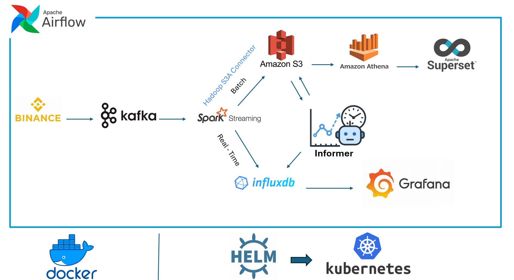
### 🤖 Informer-AI Module

#### Functionality

- Input data is loaded from **S3** (time-series format).
- Performs **short-term forecasting** using the **Informer** model.
- Supports **automatic training and prediction** workflows.
- Automatically generates **charts and dashboards** on:
  - **Grafana**
          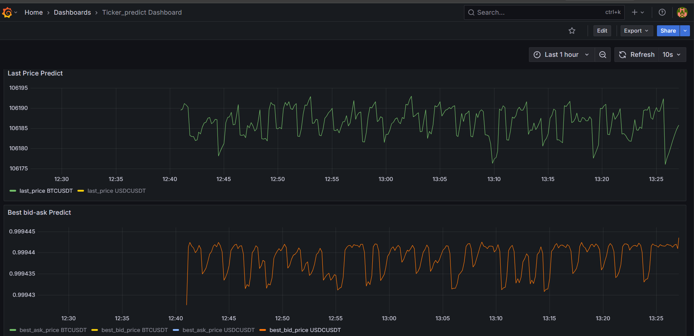
  - **Superset**
          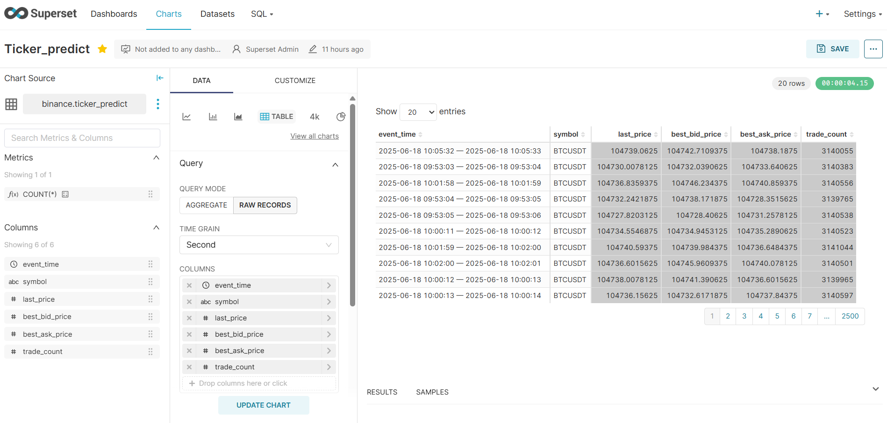
- Currently supports only the **`ticker`** data stream.
- Codebase is **modular** and **easily extendable** for other data flows.
### Informer-AI-Architecture
Below is a high-level overview of the system architecture:
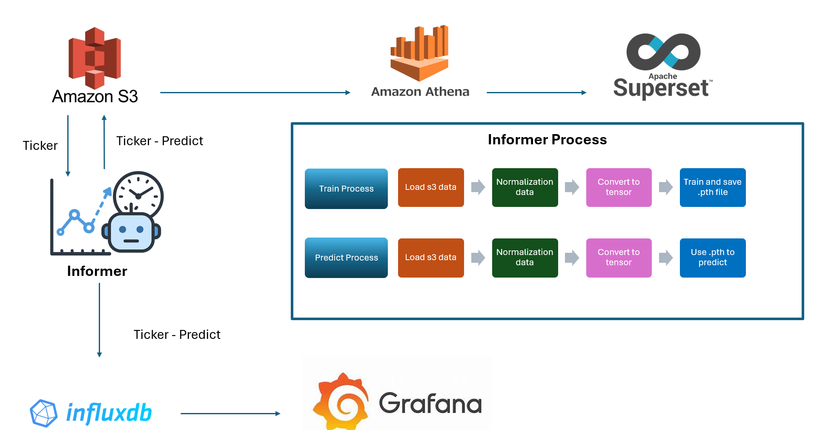

## 🔧 Installation
### 📥 Prerequisites
- [Git](https://git-scm.com/downloads)
- [Docker Desktop](https://www.docker.com/products/docker-desktop)
- [Kubernetes](https://kubernetes.io/docs/tasks/tools/install-kubectl-windows)
- [Minikube](https://minikube.sigs.k8s.io/)
- [Helm](https://helm.sh/)
-   **Clone Repository & Download Dependencies:**
    ```bash
    git clone https://github.com/THANHTINHSHR/DWH-Stock-BigData/tree/Airflow-Orchestration
    cd DWH-Stock-BigData
    ```
    - Download the required `jars`folders from this [Google Drive link.](https://drive.google.com/file/d/19l1vo4G3sWoPF1UYXeGnaES5Ny_m9Xm8/view?usp=sharing). Extract and copy all file `.jar` into folder `/jars`
    - Download [spark-3.5.6-bin-hadoop3.tgz](https://dlcdn.apache.org/spark/spark-3.5.6/spark-3.5.6-bin-hadoop3.tgz) and copy to folder `/tar`.
### 🐳 Docker Setup
 📌 **Note: In Docker, the project runs as isolated containers and does not support an orchestrator.**

1.  **Configure environment variables:**
    - Create a `.env` file in the project root (you can copy `.env.example` if provided in the repository) and populate it with your specific configuration values.
    Pay close attention to API keys, tokens, and AWS credentials. Some keys (like for InfluxDB and Grafana) will be obtained in the next step.
    For `SUPERSET_SECRET_KEY`, generate a strong random string (e.g., using `openssl rand -base64 32`) and add it to your `.env` file now.
    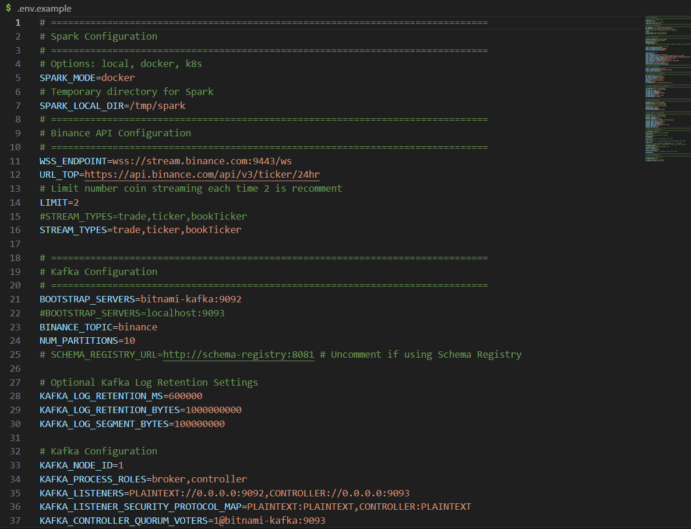
2.  **Initial Service Startup & Key Generation:**

    -   Run:
        ```bash
        docker-compose -f docker-compose-services.yml up --build
        ```
    - Access the InfluxDB UI (e.g., `http://localhost:8086`) and Grafana UI (e.g., `http://localhost:3000`) to complete their initial setup and generate the necessary API tokens/keys (`INFLUXDB_TOKEN`, `GRAFANA_KEY`).


3.  **Configure Keys & Finalize Setup:**
    -   Update your `.env` file with the `INFLUXDB_TOKEN` and `GRAFANA_KEY` obtained in the previous step.
    -   Ensure the `SUPERSET_SECRET_KEY` (generated in step 2) is also correctly set in your `.env` file.
    -   After config, build two container:

        - dwh_stock_bigdata
        ```bash
        docker-compose -f docker-compose-project.yml build
        ```
    - For Informer module:
        - informerAI_trainer
        ```bash
        docker-compose -f docker-compose-trainer.yml build
        ```
        - informerAI_trainer
        ```bash
        docker-compose -f docker-compose-predictor.yml build
        ```
        All components should now be fully functional with the correct API keys. After this step, your system is ready to operate as described in the "Running the Application" section.
### 🌐 Kubernetes Setup

1. **Download/Build Images**
   - Build Docker images locally using the provided PowerShell script:
     ```powershell
     ./script-build-images.ps1
     ```

2. **Set Up Secret Variables**
   - Add your environment secrets to each file in the `secret-tmp/` folder.
   - Then copy the generated `values-secret.yaml` files into the corresponding folders under `helm-chart/`.(Except `project-env-chart`)
    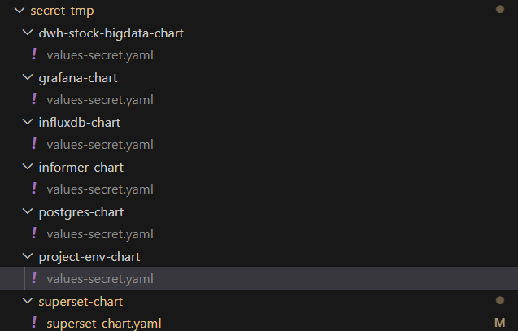

3. **Install Services with Helm**
   - Use the PowerShell script to install all services via Helm:
     ```powershell
     ./script-install-services-helm.ps1
     ```
    - Access service:
        + Access Influxdb at [http://localhost:8086](http://localhost:8086) (login and save key):
        ```
        kubectl port-forward svc/influxdb-release-influxdb-chart 8086:8086
        ```
        + Access Grafana at [http://localhost:3000](http://localhost:3000) (login and save key):
        ```
        kubectl port-forward svc/grafana-release-grafana-chart 3000:3000
        ```
        + Access Kafka UI at [http://localhost:9090](http://localhost:9090):
        ```
        kubectl port-forward svc/kafka-ui-release-kafka-ui-chart 9090:9090
        ```
        + Access Superset at [http://localhost:8088](http://localhost:8088) (login and save key):
        ```
        kubectl port-forward svc/superset-release-superset-chart 8088:8088
    - Update Service key:
        + Open file `helm-chart\secret-tmp\project-env-chart\values-secret.yaml`, update you usernames, passwords, keys, ... .Copy this file and add to `helm-chart\project-env-chart`.
        + Run script to install main project:
        ```
        ./script-install-project-helm.ps1
        ```
    - Access Airflow UI at [http://localhost:8080/](http://localhost:8080/):
       ```
       kubectl port-forward svc/airflow-release-api-server 8080:8080
        ```
        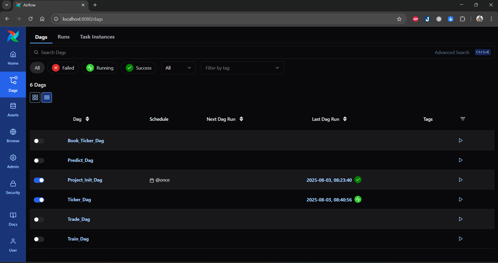
        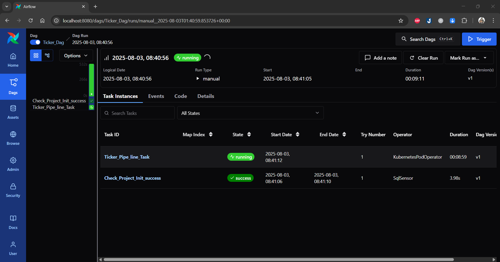

## 📸 Screenshots
- InfluxDB:
    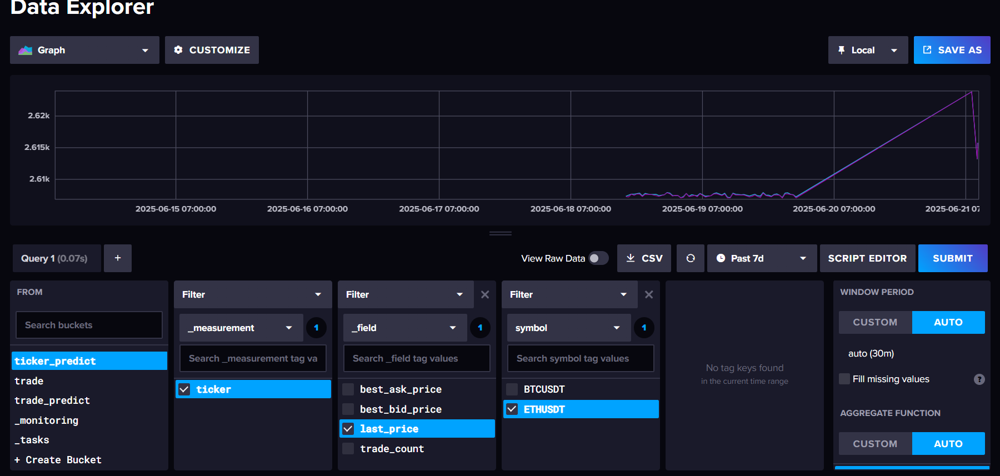
- Grafana:
    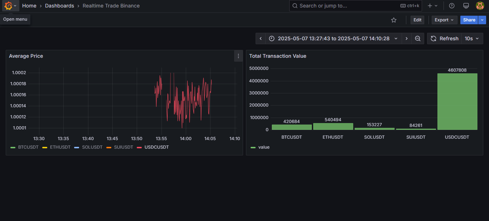
    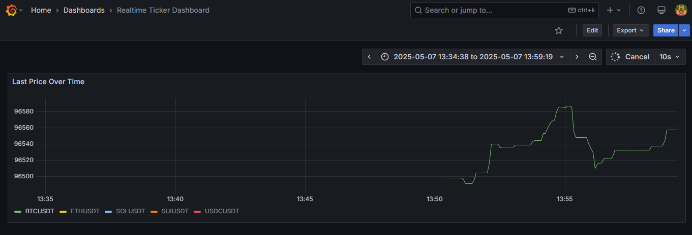
    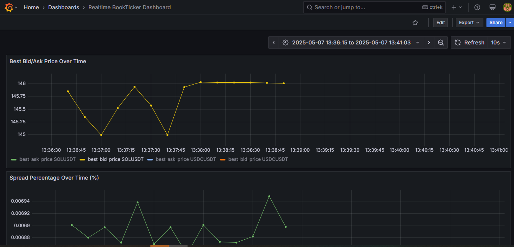

- Superset:
    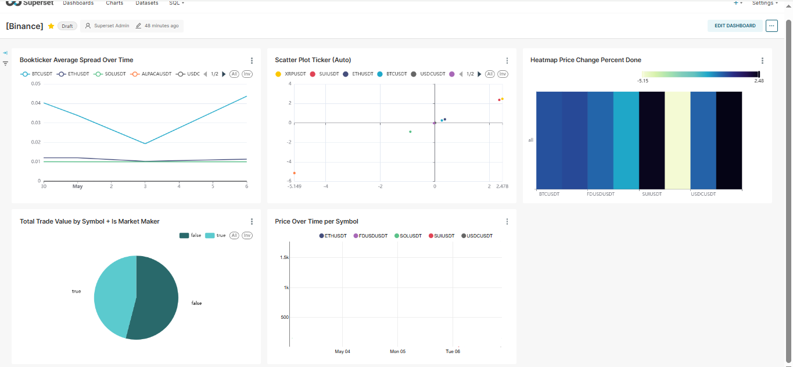

## 🎯 Key Takeaways & Experiences

- Gained hands-on experience with time-series forecasting using Informer.
- Learned to integrate ML output with real-time visualization tools (Grafana, Superset).
- Improved skills in Kubernetes deployment and Helm chart configuration.
- Understood challenges in handling big data pipelines with Spark & Kafka.
- Practiced modular and scalable code design for future extension.
- During the development of this project, I have documented several key experiences, challenges, and solutions.
You can find detailed experience logs in the `notebooks` directory of this project. Please note that these logs are primarily written in Vietnamese.

## Contact

If you have any questions, suggestions, or would like to discuss this project further, feel free to reach out:

- **Email**: thanhtinh14.16.1998@gmail.com
- **Phone**: 0899986747
- **ZALO**: 0356657722